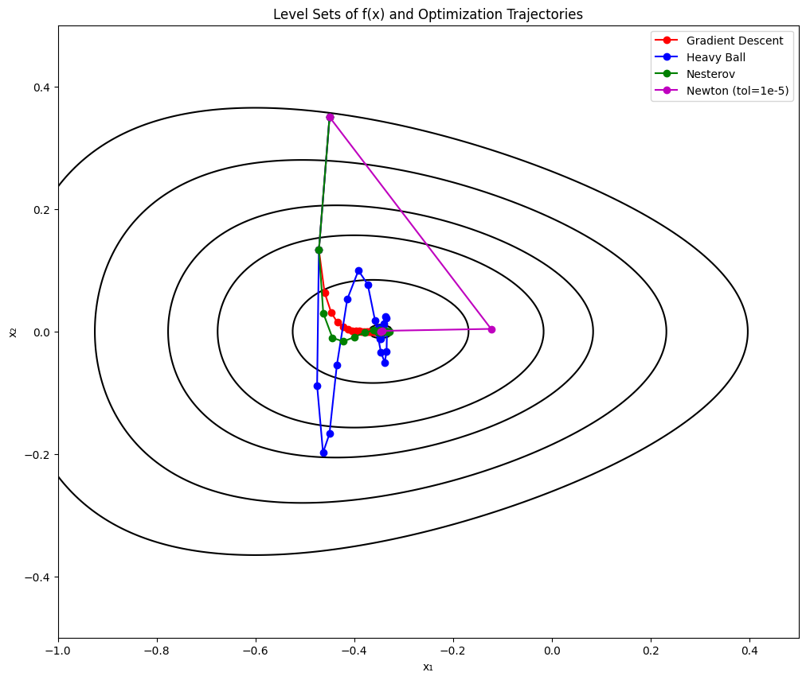
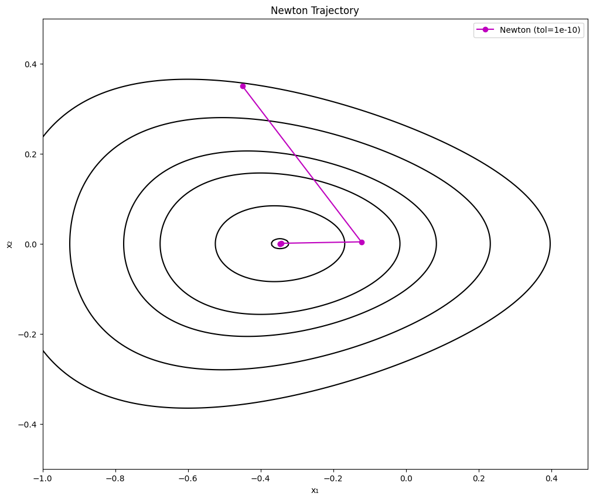

# optimization-algorithms
Implementations of gradient descent, heavy ball, Nesterov acceleration, and Newton’s method on a convex test problem.

# Project Title: Optimization Algorithms

## Overview
This project implements classical optimization algorithms —
Gradient Descent, Heavy Ball, Nesterov Accelerated Gradient,
and Newton’s Method — and visualizes their trajectories on a convex test function.

## Key Features
- Implements multiple optimization methods from scratch in Python.
- Plots convergence trajectories and compares iteration counts.
- Educational example for convex optimization coursework.

## Example Output



## Skills Demonstrated
- Numerical optimization (GD, NAG, Newton)
- Python (NumPy, Matplotlib)
- Convex analysis

## How to Run
```bash
pip install -r requirements.txt
python optimization_methods.py
